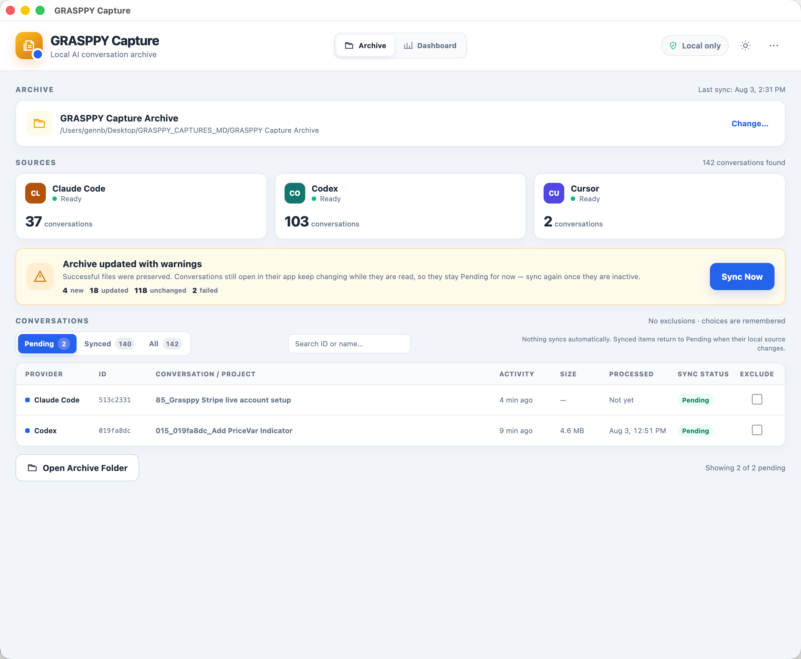
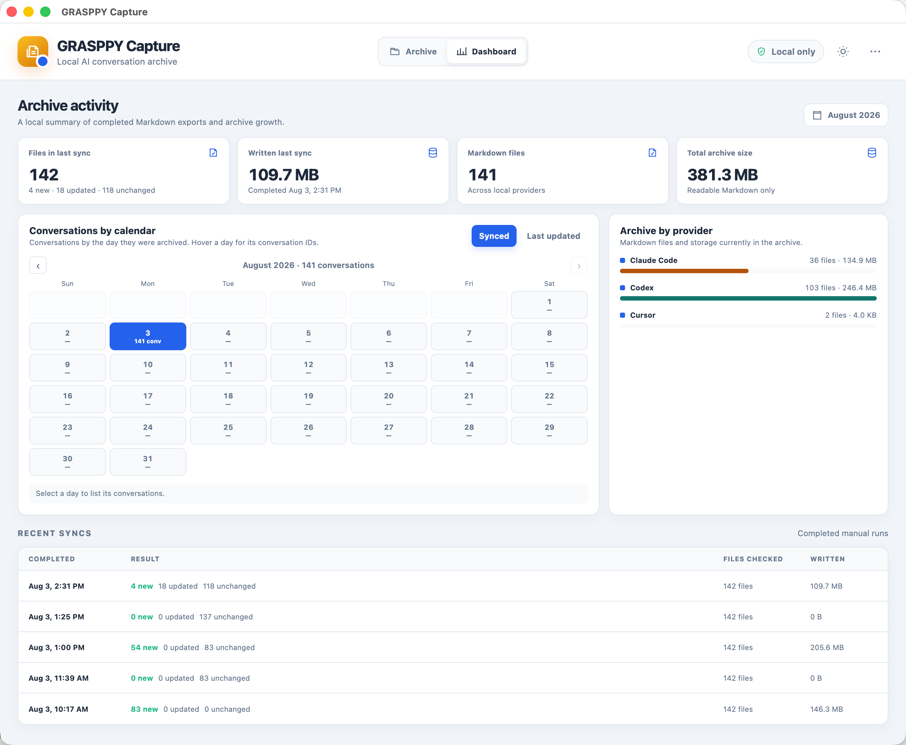

# GRASPPY Capture

[](LICENSE)
[-lightgrey.svg)](https://github.com/grasppy-labs/grasppy-capture/releases)
[](https://github.com/grasppy-labs/grasppy-capture/releases/latest)

**A local archive for your AI coding conversations.** Capture finds the conversations that Claude Code, Codex, and Cursor already store on your Mac and converts them into clean, readable Markdown files in one folder you own.

Your AI conversations contain real work — decisions, fixes, designs, research. The tools keep them in internal formats (JSONL logs, SQLite databases) that are hard to read and easy to lose. Capture turns that into a permanent, portable, searchable archive.

One real archive, after one afternoon of use: **142 conversations, 400 MB of readable Markdown** — months of work across three AI tools, in one folder, greppable and portable forever.

## Screenshots

| Archive | Dashboard |
|---|---|
|  |  |

## What it does

- **Finds conversations automatically** from Claude Code (`~/.claude`), Codex (`~/.codex`), and Cursor — no exports, no copy-paste.
- **Converts each one to validated Markdown** with a stable filename, message markers, and metadata (session ID, timestamps, message counts). Every file is verified against its own format contract before it is written.
- **Nothing syncs without you.** You review the catalog, exclude what you want, and click Sync Now. Writes are atomic — an interrupted sync never leaves a half-written file.
- **Remembers state between launches.** Unchanged conversations are skipped by file stats alone, so a re-scan of a multi-gigabyte history takes seconds.
- **Dashboard** with per-day calendars (when conversations were archived, and when they were last worked on), provider breakdowns, and sync history.

## Local only — verifiably

Capture makes no network requests while cataloging or syncing. Your conversations never leave your machine. The single exception is the **Check for Updates** menu item, which runs only when you click it and sends nothing but a version query to GitHub. This repository exists so you can verify all of that yourself.

## Install

1. Download the latest `.dmg` from [Releases](https://github.com/grasppy-labs/grasppy-capture/releases).
2. Open it and drag **GRASPPY Capture** to Applications.
3. First launch: right-click the app → **Open** (the build is not notarized by Apple; this one-time step tells macOS you trust it).
4. Pick a parent folder for your archive. Capture creates `GRASPPY Capture Archive/` inside it and never writes anywhere else.

Currently macOS (Apple Silicon) only.

The complete [user guide](https://grasppy.com/capture/guide) covers setup, sync statuses, and troubleshooting — it's also one click away from the **?** button in the app's header.

## Build from source

```bash
git clone https://github.com/grasppy-labs/grasppy-capture.git
cd grasppy-capture
npm install
npm start          # build the renderer and run the app
npm test           # run the full test suite
npm run dmg:mac    # produce release/GRASPPY Capture-<version>-arm64.dmg
```

## How it works

```
discover  → list conversations from known provider folders (stat-based, fast)
normalize → parse each conversation into a provider-neutral event stream
render    → produce Markdown with balanced fences and role markers
validate  → verify the rendered document against the format contract
write     → atomic write into the archive; the manifest records the result
```

Design details live in [PRODUCT.md](PRODUCT.md), [DESIGN.md](DESIGN.md), and [NATIVE_MESSAGING_V1.md](NATIVE_MESSAGING_V1.md).

Every archived file carries a stable name and a self-describing header:

```markdown
claude-code--Backtesting-executor-parity--64c91278-….md

# Markdown Export - Claude Code
**Provider:** claude-code
**Messages:** 330
**Session ID:** 64c91278-…
**Source Updated:** 2026-07-16T00:57:35.042Z
**Conversation Turns:** 165
```

## Questions you'd reasonably ask

**Is anything uploaded anywhere?**
No. Cataloging and syncing make zero network requests. The only network call in the app is the Check for Updates menu item, it runs only when you click it, and it sends nothing but a version query to GitHub.

**What does "Pending" mean after a sync?**
Usually that a conversation is still open in its app. A file that changes while it is being read is skipped on purpose — a half-written archive is worse than a late one. It syncs the next time you run a sync while it's idle.

**What if a source file is malformed?**
Every conversation is validated before it is written, and every write is atomic. A conversation that can't be rendered correctly is reported, not silently mangled — and never overwrites a previous good copy.

**Does it modify my Claude Code / Codex / Cursor data?**
Never. Provider folders are opened read-only. Capture writes to exactly one place: the archive folder you chose.

**Why do big re-scans finish in seconds?**
The catalog trusts its own bookkeeping: a source whose size and modification time are unchanged since its last successful archive is skipped without reading a byte. Anything new or changed gets the full parse.

**Windows / Linux / Intel Macs?**
Not yet — this release is macOS on Apple Silicon. The core is plain Node.js with no native dependencies, so ports are mostly packaging work. Open an issue if you want one; it helps us order the queue.

## Contributing

Issues and pull requests are welcome. Changes land only through review and merge by the maintainers. By contributing, you agree that your contributions are licensed under the same GPL-3.0 terms as the project.

## About

Built by **Grasppy Labs** — makers of [Grasppy](https://grasppy.com), the AI Context Workspace. Capture is the free, open-source companion: it gets your conversations out of the tools and into files you own. Grasppy takes them further — analysis, organization, and reuse across every AI tool you use.

## License

[GPL-3.0](LICENSE) · Copyright © 2026 Grasppy Labs LLC. GRASPPY™ is a trademark of Grasppy Labs; this license covers the code, not the name.
